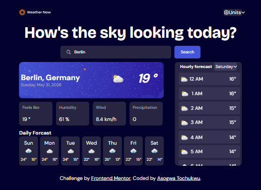
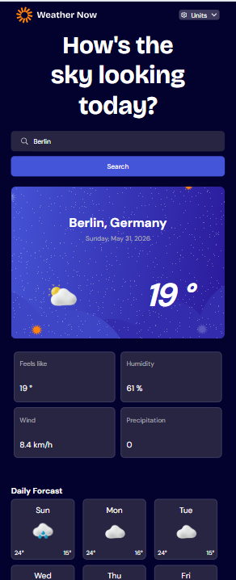

# Frontend Mentor - Weather app solution

This is a solution to the [Weather app challenge on Frontend Mentor](https://www.frontendmentor.io/challenges/weather-app-K1FhddVm49). Frontend Mentor challenges help you improve your coding skills by building realistic projects. 

## Table of contents

- [Overview](#overview)
  - [The challenge](#the-challenge)
  - [Screenshot](#screenshot)
  - [Links](#links)
- [My process](#my-process)
  - [Built with](#built-with)
  - [What I learned](#what-i-learned)
  - [Continued development](#continued-development)
  - [Useful resources](#useful-resources)
- [Author](#author)


## Overview
- This is  a **Weather app**, which features a search input and its previous most recent search history, a daily weather display including weather icon, the temperature, pressure, humidity and precipitation, the weekly weather report and an hourly weater report based on the selected day within the week.

### The challenge

Users should be able to:

- Search for weather information by entering a location in the search bar
- View current weather conditions including temperature, weather icon, and location details
- See additional weather metrics like "feels like" temperature, humidity percentage, wind speed, and precipitation amounts
- Browse a 7-day weather forecast with daily high/low temperatures and weather icons
- View an hourly forecast showing temperature changes throughout the day
- Switch between different days of the week using the day selector in the hourly forecast section
- Toggle between Imperial and Metric measurement units via the units dropdown 
- Switch between specific temperature units (Celsius and Fahrenheit) and measurement units for wind speed (km/h and mph) and precipitation (millimeters) via the units dropdown
- View the optimal layout for the interface depending on their device's screen size
- See hover and focus states for all interactive elements on the page

### Screenshot





### Links

- Solution URL: [https://github.com/Tochukwu-1/Weather-app]()
- Live Site URL: [https://teesconceptwebapp.netlify.app/]()

## My process
- Installing vite
- Creating a git repository
- Pushing the project to github
- Setting of the semantic elements and building of website structure 
- Styling of the Elements to their corresponding ui/ux designs
- Adding functinalities using useStates, useEffects and setTimeouts
- Api integrations and hosting
- Ensuring correct replication of the ui/ux code and pushing of last commit. 

### Built with

- Semantic HTML5 markup
- CSS custom properties
- Flexbox
- CSS Grid
- [React](https://reactjs.org/) - JS library


### What I learned
- Api integration starting fron the fetching of the api, the async functions , the await, the try, catch and finally


```js
 function fetchWeather() {
      try {
        const geoRes = await fetch(
          `https://geocoding-api.open-meteo.com/v1/search?name=${location.currentLocation}`,
        );
        setIsLoading(true);
        if (!geoRes) throw new Error("Failed to fetch location");
      }
      catch(error){
        console.log(error)
      }
      finally{
        setIsLoading(false)
      }
 }
      
```


### Continued development

After this project, the future projects will be focusng on more complex **Api integration** and the possibly on other js frameworks like Nextjs and Vuejs


### Useful resources

- [w3schools.com](https://www.w3schools.com) - This helped me have a better understanding at styling elements, where the effect of the elements actions are to affect its parents or children


## Author

- Website - [Asogwa Tochukwu](https://tochukwu-1.github.io/My-portfolio)
- Frontend Mentor - [Tochukwu](https://www.frontendmentor.io/profile/Tochukwu-1)


